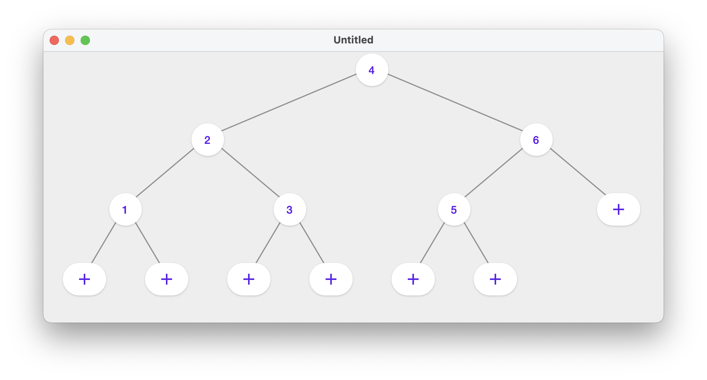
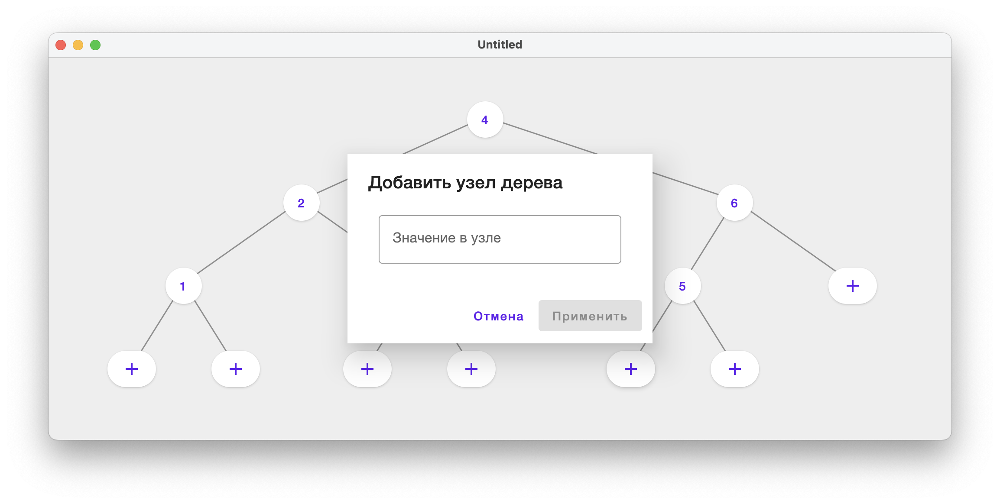
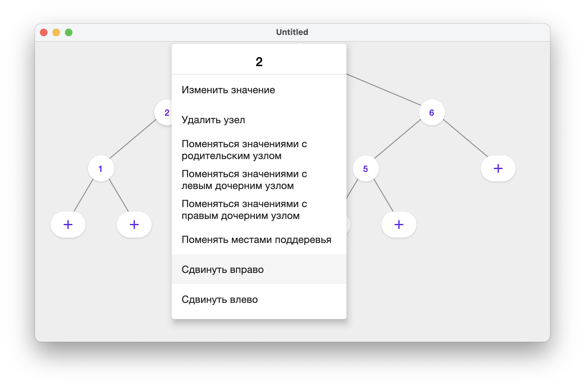

# Algos course work - AVL tree

## TODO

The developed program should provide to user options to perform direct operations with a binary tree, with an AVL tree and visualization of the result, and the ability to see the efficiency of sorting using an AVL tree in comparison with sorting by direct inclusion.

## Current state

Tree editor

New node creation dialog

Menu of options for working with a tree node

